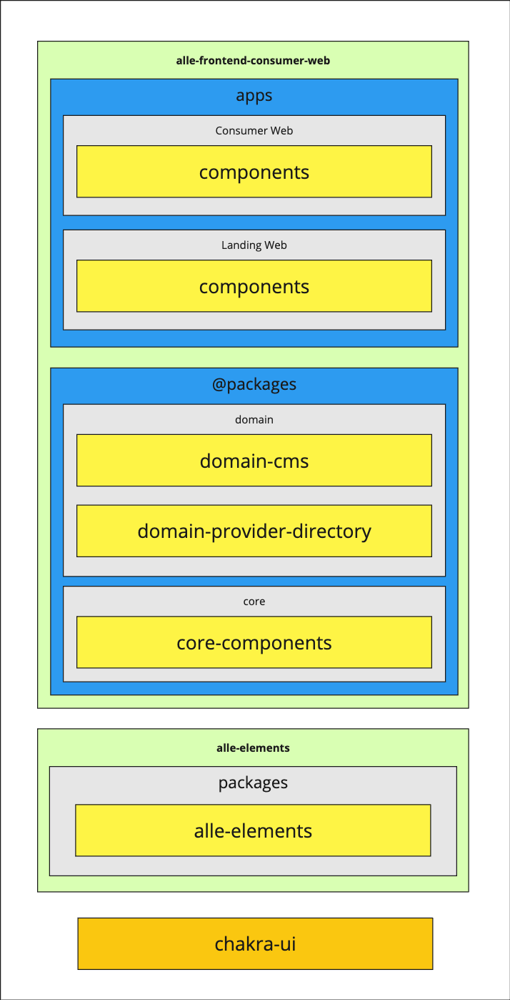

## Consumer Web - Contributing

## Problems with current components

1. component libraries have no identity; no layers
2. JS where CSS should be used
3. outdated 3rd party libraries
4. no proper patterns
   1. mis-using patterns like compound components
5. terrible prop usage
6. outer layer components with business logic

--------------------------------------------------

library considerations
- chakra UI
- alle-elements

## Styles

### Specificity

Specificity is an extremely important thing to consider when building UI, especially when we have so many different layers of components. Consider the layers currently in our frontend codebase:

In this image, we are looking at two different github repositories: `consumer-web` and `alle-elements`. Alle Elements contains a bunch of atomic-level (see [Atomic Design](#atomic-design)) components like buttons, typography, spacing, text inputs, and modals.

The consumer web repo contains two primary directories; Apps and Packages. Apps contain our actual hosted, user-facing applications. Packages contains various layers of component libraries. Each yellow box is a place ui components can be built, and each box can import components from any of the yellow boxes below it (for example, `domain-cms` can import from `core-components`, `alle-elements`, or `chakra-ui` directly).

---

Now imagine a component, `Button`, in `alle-elements` being styled with anything but the lowest specificity; Let's pretend that the button applies all of its styles with multiple classes, totalling a specificity of 30. Now let's assume that we want to build a `BrandButton` in `core-components` that imports and modifies `alle-elements/Button`. In order to override the styles, we'll need a combination of selectors totalling at least 31 specificity.

Then going a step further, we now need to import that `BrandButton` into `domain-cms` for an `onClick` handler to query data, but we also need to add some styles, so now we need a selector with still a higher specificity, and we're entering "selector hell" with things like `.button.primary.action.brandButton {...}`, or having to resort to using ids in a component library 🤢

And on and on we go, adding more and more complex selectors with each layer.

The moral of the story is this: build small components with low specificity. If our initial button in alle elements used just a single `.button {}` selector (with a specificity of 10), building on top of it in any and all of the above layers becomes significantly easier and cleaner, and less prone to bugs.

See [these mdn docs](https://developer.mozilla.org/en-US/docs/Web/CSS/Specificity) or [this article](https://css-tricks.com/specifics-on-css-specificity/) to learn more about how specificity works.

### Atomic Design

### SCSS

## Development Environment

### Storybook

### Chromatic

### Typescript Path Aliases

## Code Standards

### Component props should be used explicitly instead of passing in via the spread operator ({...props})

### Parent components should be able to easily override styles

### Styles should be done in a SCSS file using BEM, Atomic CSS, and Tailwind CSS

- with chakra components recommending style props like sx, mr, etc, this 

### Do not use JS when CSS will suffice

### Prefer IndexCased component and class names

### Prefer semantic HTML over generic tags

### CSS class names are joined in an array

### Global CSS classes should be prefixed

### Components should not be aware of ADL data

### Prefer kebab-casing for file paths

### Files owned by a single team should be explicitly owned

### Directory structures should have a similar structure

a good example of component folders are:

src/
  components/
    header/
      index.ts
      header.tsx
      header.css
      header.*.ts
    wallet-card/
      index.ts
      wallet-card.tsx
      wallet-card.css
      wallet-card.*.ts

## Design Philosophies

### Base/Variant

### Presentational vs Container Components

### Compound Components